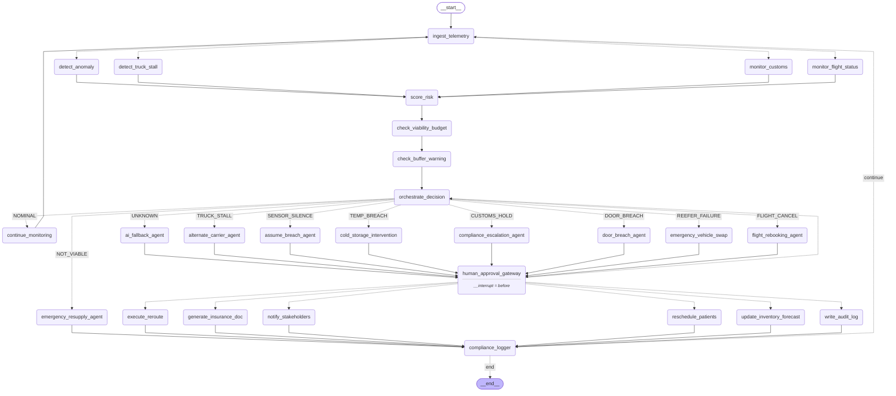

# AI Cargo Monitor -- LangGraph Workflow

```mermaid
---
config:
  flowchart:
    curve: linear
---
graph TD;
	__start__([<p>__start__</p>]):::first
	ingest_telemetry(ingest_telemetry)
	detect_anomaly(detect_anomaly)
	detect_truck_stall(detect_truck_stall)
	monitor_flight_status(monitor_flight_status)
	monitor_customs(monitor_customs)
	score_risk(score_risk)
	check_viability_budget(check_viability_budget)
	check_buffer_warning(check_buffer_warning)
	orchestrate_decision(orchestrate_decision)
	continue_monitoring(continue_monitoring)
	cold_storage_intervention(cold_storage_intervention)
	emergency_vehicle_swap(emergency_vehicle_swap)
	alternate_carrier_agent(alternate_carrier_agent)
	flight_rebooking_agent(flight_rebooking_agent)
	compliance_escalation_agent(compliance_escalation_agent)
	assume_breach_agent(assume_breach_agent)
	door_breach_agent(door_breach_agent)
	emergency_resupply_agent(emergency_resupply_agent)
	ai_fallback_agent(ai_fallback_agent)
	human_approval_gateway(human_approval_gateway<hr/><small><em>__interrupt = before</em></small>)
	execute_reroute(execute_reroute)
	notify_stakeholders(notify_stakeholders)
	reschedule_patients(reschedule_patients)
	generate_insurance_doc(generate_insurance_doc)
	update_inventory_forecast(update_inventory_forecast)
	write_audit_log(write_audit_log)
	compliance_logger(compliance_logger)
	__end__([<p>__end__</p>]):::last
	__start__ --> ingest_telemetry;
	ai_fallback_agent --> human_approval_gateway;
	alternate_carrier_agent --> human_approval_gateway;
	assume_breach_agent --> human_approval_gateway;
	check_buffer_warning --> orchestrate_decision;
	check_viability_budget --> check_buffer_warning;
	cold_storage_intervention --> human_approval_gateway;
	compliance_escalation_agent --> human_approval_gateway;
	compliance_logger -. &nbsp;end&nbsp; .-> __end__;
	compliance_logger -. &nbsp;continue&nbsp; .-> ingest_telemetry;
	continue_monitoring --> ingest_telemetry;
	detect_anomaly --> score_risk;
	detect_truck_stall --> score_risk;
	door_breach_agent --> human_approval_gateway;
	emergency_resupply_agent --> compliance_logger;
	emergency_vehicle_swap --> human_approval_gateway;
	execute_reroute --> compliance_logger;
	flight_rebooking_agent --> human_approval_gateway;
	generate_insurance_doc --> compliance_logger;
	human_approval_gateway -.-> execute_reroute;
	human_approval_gateway -.-> generate_insurance_doc;
	human_approval_gateway -.-> notify_stakeholders;
	human_approval_gateway -.-> orchestrate_decision;
	human_approval_gateway -.-> reschedule_patients;
	human_approval_gateway -.-> update_inventory_forecast;
	human_approval_gateway -.-> write_audit_log;
	ingest_telemetry -.-> detect_anomaly;
	ingest_telemetry -.-> detect_truck_stall;
	ingest_telemetry -.-> monitor_customs;
	ingest_telemetry -.-> monitor_flight_status;
	monitor_customs --> score_risk;
	monitor_flight_status --> score_risk;
	notify_stakeholders --> compliance_logger;
	orchestrate_decision -. &nbsp;UNKNOWN&nbsp; .-> ai_fallback_agent;
	orchestrate_decision -. &nbsp;TRUCK_STALL&nbsp; .-> alternate_carrier_agent;
	orchestrate_decision -. &nbsp;SENSOR_SILENCE&nbsp; .-> assume_breach_agent;
	orchestrate_decision -. &nbsp;TEMP_BREACH&nbsp; .-> cold_storage_intervention;
	orchestrate_decision -. &nbsp;CUSTOMS_HOLD&nbsp; .-> compliance_escalation_agent;
	orchestrate_decision -. &nbsp;NOMINAL&nbsp; .-> continue_monitoring;
	orchestrate_decision -. &nbsp;DOOR_BREACH&nbsp; .-> door_breach_agent;
	orchestrate_decision -. &nbsp;NOT_VIABLE&nbsp; .-> emergency_resupply_agent;
	orchestrate_decision -. &nbsp;REEFER_FAILURE&nbsp; .-> emergency_vehicle_swap;
	orchestrate_decision -. &nbsp;FLIGHT_CANCEL&nbsp; .-> flight_rebooking_agent;
	reschedule_patients --> compliance_logger;
	score_risk --> check_viability_budget;
	update_inventory_forecast --> compliance_logger;
	write_audit_log --> compliance_logger;
	classDef default fill:#f2f0ff,line-height:1.2
	classDef first fill-opacity:0
	classDef last fill:#bfb6fc

```
